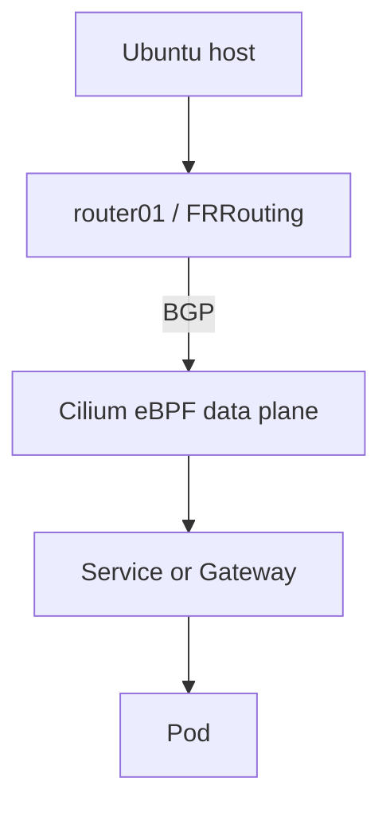

# Architecture

## Stage 1 target

The Ubuntu 24.04 workstation remains the daily-use host. Libvirt will later provide an isolated NAT network named `lab-net` (`10.10.10.0/24`) with Talos control-plane and worker VMs plus an FRRouting router. Kubernetes LoadBalancer IPs will use `10.10.100.0/24`; Cilium and FRRouting will peer with ASNs `65010` and `65000` respectively.

## Safety boundary

The lab must not change the physical NIC, default route, host firewall, unrelated Docker/VPN configuration, bootloader, partitions, or public exposure. Each phase is isolated, declarative where practical, validated, documented, and committed separately.

## Capacity note

The revised VM plan declares 118 GiB of virtual disk capacity: 30 GiB for the control plane, 40 GiB for each worker, and 8 GiB for the router. This leaves approximately 36 GiB of current physical-disk headroom. QCOW2 images must still be monitored because thin provisioning does not reserve capacity.
