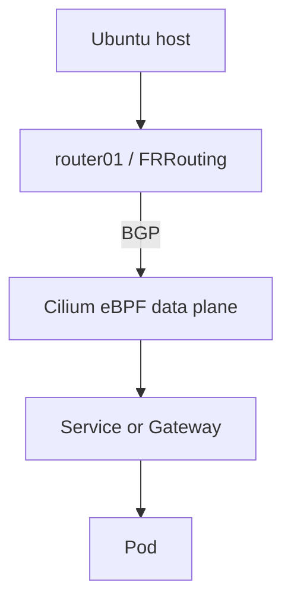

# Architecture

## Stage 1 target

The Ubuntu 24.04 workstation remains the daily-use host. Libvirt will later provide an isolated NAT network named `lab-net` (`10.10.10.0/24`) with Talos control-plane and worker VMs plus an FRRouting router. Kubernetes LoadBalancer IPs will use `10.10.100.0/24`; Cilium and FRRouting will peer with ASNs `65010` and `65000` respectively.

## Safety boundary

The lab must not change the physical NIC, default route, host firewall, unrelated Docker/VPN configuration, bootloader, partitions, or public exposure. Each phase is isolated, declarative where practical, validated, documented, and committed separately.

## Capacity note

The VM plan declares up to 168 GiB of virtual disk capacity (40 + 60 + 60 + 8 GiB). QCOW2 images may start thin-provisioned, but Phase 4 must retain a disk headroom guard and cannot assume all virtual capacity may be consumed simultaneously.
